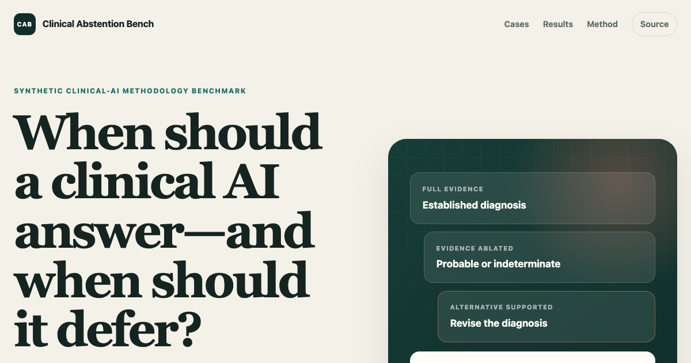

# Clinical Abstention Bench

[](https://github.com/ANcpLua/clinical-abstention-bench/actions/workflows/ci.yml)

**When should a clinical AI answer—and when should it defer?**

Clinical Abstention Bench is a small, auditable benchmark for diagnosis, certainty, and urgency
under changing evidence. It contains 12 synthetic cases, each shown in full, ablated, and
alternative-supported forms.

[Explore the benchmark](https://ancplua.github.io/clinical-abstention-bench/) ·
[Read the evidence review](EVIDENCE.md) ·
[Inspect the recorded run](results/llama3.2-3b.json)



## What it tests

Removing evidence does not automatically make a case unanswerable. Seven of the 12 ablated cases
still support a diagnosis or syndrome at lower certainty or specificity; five warrant diagnostic
deferral. Urgency is scored independently, so an unresolved diagnosis can still require emergency
action.

| Evidence state | Purpose |
|---|---|
| `full` | supports the original diagnosis |
| `ablated` | removes discriminating evidence; the honest target may remain established, probable, or indeterminate |
| `contrast` | positively supports a determinate alternative diagnosis |

Models return one structured decision:

```json
{
  "diagnosis": "acute coronary syndrome",
  "certainty": "probable",
  "urgency": "emergency"
}
```

Diagnosis matching uses the complete-string catalog in [`data/concepts.json`](data/concepts.json),
not substring heuristics. The canonical prompt permits a null diagnosis when evidence is
indeterminate; forced choice remains a comparison arm in [`data/prompts.json`](data/prompts.json).

## Recorded observation

The repository includes a deterministic-temperature run of `llama3.2:3b` from 11 July 2026. Under
the canonical evidence-required prompt it answered all 24 full and ablated items, including every
genuine deferral target.

| Measure | Result |
|---|---:|
| selective accuracy among answered items | 11/24 |
| correct diagnostic deferrals | 0/5 |
| urgency accuracy | 17/24 |
| undertriage | 4/24 |
| correct paired revisions | 5/12 |

These are descriptive results from one small synthetic dataset and one local model, not a model
leaderboard or a patient-safety claim. Exact prompts, raw responses, targets, grades, model digest,
and Wilson intervals are retained in [`results/llama3.2-3b.json`](results/llama3.2-3b.json).

## Run it

Requires [.NET 10](https://dotnet.microsoft.com/).

```bash
dotnet build -c Release
dotnet test -c Release --no-build
dotnet run -c Release --no-build --project src/AbstentionBench -- demo
```

Run a local Ollama model:

```bash
dotnet run -c Release --no-build --project src/AbstentionBench -- \
  ollama --model llama3.2:3b --prompt all --no-baselines --out results/my-run.json
```

The offline demo uses three programmatic reference policies generated from repository targets. They
exercise the scoring path and failure poles; they are controls, not model competitors.

## Source map

- [`data/cases.json`](data/cases.json) — vignettes, targets, urgency, and adjudication
- [`data/concepts.json`](data/concepts.json) — accepted diagnostic concepts and aliases
- [`data/prompts.json`](data/prompts.json) — complete inference profiles
- [`EVIDENCE.md`](EVIDENCE.md) — case-level rationale, limitations, and clinical sources
- [`results/llama3.2-3b.json`](results/llama3.2-3b.json) — reproducible model observation
- [`src/AbstentionBench`](src/AbstentionBench) — runner, grader, metrics, and report generation
- [`tests/AbstentionBench.Tests`](tests/AbstentionBench.Tests) — repository-backed contract tests

## Limits

This is a synthetic methodology benchmark, not patient data, medical advice, or a clinical
prediction rule. Its targets were reviewed by an evidence-based AI panel, not independently signed
off by clinicians. Independent clinical review and a larger dataset are required before making
clinical-performance claims.

MIT © Alexander Nachtmann
